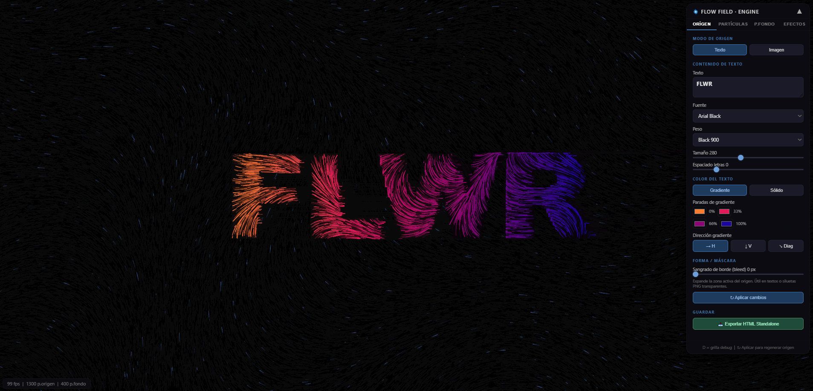

<div align="center">

# Flow Field Studio

**Generador interactivo de partículas con campos de flujo a partir de texto o imágenes**

Renderiza en tiempo real con WebGPU (o Canvas2D como fallback). Captura de video en WebM (VP9).

[](https://flowfieldstudio.jaralorescl.workers.dev)
[](https://github.com/javierjarart/FlowFieldStudio)



---

</div>

## Características

| | |
|---|---|
| **Origen** | Texto (fuente, peso, tamaño, color sólido o degradado) o imagen |
| **Partículas** | ~2400 partículas (texto + fondo) con física de flow field basada en ruido Perlin |
| **Estilos de trail** | Sólido, dashed, dotted, glow — asignados aleatoriamente por partícula |
| **Formas** | Círculo, triángulo, diamante, estrella, cuadrado (por partícula, sobre la historia de posiciones) |
| **Interacción** | Arrastrar el mouse empuja las partículas (push distortion, radio/ fuerza configurables) |
| **Audio reactivo** | Captura de micrófono, análisis FFT en 3 bandas, mapeo banda→parámetro, detección de beat |
| **Modulación (LFO)** | Osciladores (seno, cuadrada, sierra, triángulo) que modulan cualquier parámetro en tiempo real |
| **Post-procesado** | Bloom, aberración cromática, viñeta, grano de película (Canvas2D, extensible a WebGPU) |
| **Renderizado** | WebGPU (compute + render shaders WGSL) con fallback automático a Canvas2D |
| **Fondo** | Color sólido, degradado lineal o radial |
| **Grabación** | WebM VP9 a 15 Mbps, descarga automática |
| **Export** | HTML standalone con estado actual incrustado |
| **Móvil** | Panel tipo bottom sheet, fullscreen automático en landscape |

## Demo online

[https://flowfieldstudio.jaralorescl.workers.dev](https://flowfieldstudio.jaralorescl.workers.dev)

## Uso local

```bash
git clone https://github.com/javierjarart/FlowFieldStudio.git
cd FlowFieldStudio
node build.js
# Abrir index.html en el navegador
# (sin servidor HTTP — el build emsambla todo en un script inline)
```

Para desarrollo con módulos ES (hot reload):

```bash
python3 -m http.server 8080
# Abrir http://localhost:8080
```

## Controles rápidos

| Tecla / Acción | Efecto |
|---|---|
| `D` | Alternar grilla debug |
| Arrastrar canvas | Push distortion (aleja partículas del cursor) |
| Arrastrar header del panel | Mover panel flotante |
| ▲ / ▼ | Colapsar / expandir panel |
| ⚙ (móvil) | Abrir panel bottom sheet |
| Landscape (móvil) | Fullscreen automático |

## Panel de control

| Pestaña | Controles |
|---|---|---|
| **ORÍGEN** | Texto, fuente, tamaño, color, imagen, bleed radius, export HTML |
| **PARTÍCULAS** | Cantidad, velocidad, boost, trail, grosor, opacidad, forma, color, ruido, ángulo |
| **P.FONDO** | Partículas de fondo: toggle, cantidad, velocidad, trail, opacidad, color, evitación de texto, ruido |
| **EFECTOS** | Color de fondo, fade/persistencia, blend mode, **post-procesado** (bloom, CA, viñeta, grano), grabación, debug, cell size, reinicializar |
| **AUDIO** | Conectar micrófono, umbral de beat, mapeo de banda (bass/mid/treble) a parámetro con rango min/max, medidores visuales |
| **MOD** | Añadir/eliminar LFOs, forma de onda, frecuencia, amplitud, offset, target, osciloscopio en vivo |

## Tech Stack

- **Vanilla JS** ES modules (sin frameworks ni dependencias)
- **WebGPU** + **WGSL** para renderizado acelerado (compute shader + trail/shape/fade/debug pipelines)
- **Canvas2D** como fallback universal (incl. post-procesado)
- **Web Audio API** para captura de micrófono, análisis FFT y detección de beat
- **Ruido Perlin** clásico para generación de flow fields
- **MediaRecorder API** para captura de video WebM
- **Build**: script Node.js que emsambla todos los módulos en un `<script>` inline

## Arquitectura

```
js/
├── event-bus.js        — Pub/sub event system
├── state.js            — Estado reactivo (Proxy) con emisión automática de cambios
├── perlin.js           — Ruido Perlin 2D
├── audio.js            — AudioManager: mic capture, FFT, beat detection, band→param mapping
├── lfo.js              — LFO + LFOManager: waveform oscillators que modulan parámetros
├── effect.js           — Orquestador: flow field, selección de renderer, resize
├── main.js             — Entry point: canvas, loop de animación, eventos, fullscreen
├── ui.js               — Bindings del panel: sliders, toggles, pestañas, export, grabación
├── recorder.js         — Grabación de video (máquina de estados)
├── postprocess.js      — PostProcessor: bloom, CA, vignette, film grain (Canvas2D fallback)
├── renderers/
│   ├── canvas2d.js     — Renderer Canvas2D (TextParticle, BgParticle)
│   └── webgpu.js       — Renderer WebGPU (compute + pipelines)
└── gpu/
    ├── compute.js      — Shader WGSL de cómputo de partículas
    └── render.js       — Shaders WGSL de renderizado (trail, shape, fade, debug)
build.js                — Bundler (convierte ES modules → script inline)
index.html              — HTML + CSS + script emsamblado
```

## Build

```bash
node build.js
```

El script `build.js` lee los archivos en orden de dependencia, elimina imports/exports, y emsambla todo en un IIFE dentro de `index.html`. El resultado funciona en cualquier navegador sin servidor.

---

<div align="center">
  <sub>Flow Field · Source Engine &mdash; 2026</sub>
</div>
